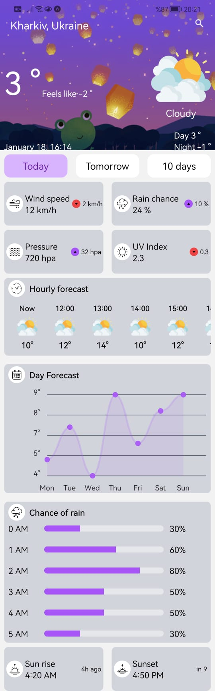
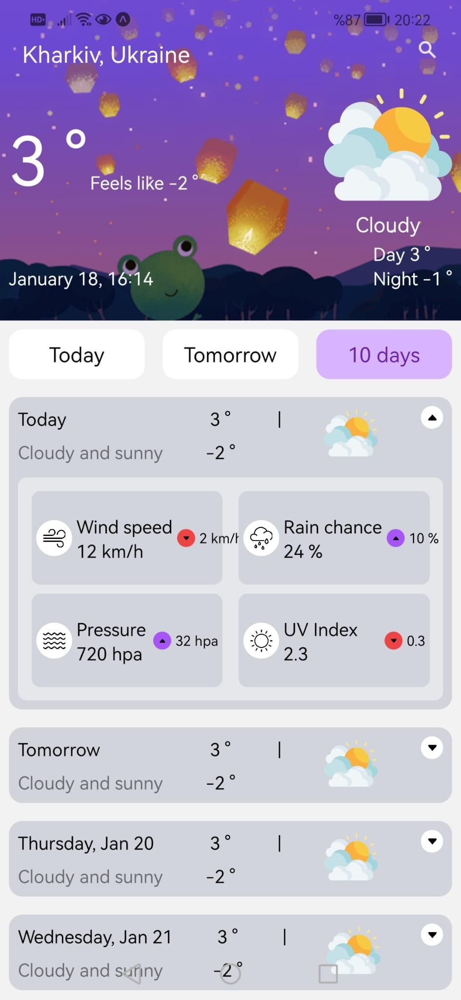

# Weather App Clone 🌤️
This project is a weather application built using Tailwind CSS and React Native.
<br>
The design is inspired by [Google Weather Redesign](https://www.figma.com/community/file/1249443729401540968) on Figma.


# App Screenshots:
<div align="center">
    
   
</div>


## Features
- Daily and hourly weather forecasts
- Rain chance graph
- Daily details (wind, UV index, pressure, etc.)
- 10-day weather outlook
- Responsive and modern design

## Technologies Used
- [React Native](https://reactnative.dev/)
- [Tailwind CSS](https://tailwindcss.com/)
- [Expo](https://expo.dev/)
- `react-native-chart-kit` (grafikler için)
- `react-native-progress` (progress bar için)


## Getting Started
1. Install dependencies

   ```bash
   npm install
   ```

2. Start the app

   ```bash
   npx expo start
   ```

In the output, you'll find options to open the app in a

- [development build](https://docs.expo.dev/develop/development-builds/introduction/)
- [Android emulator](https://docs.expo.dev/workflow/android-studio-emulator/)
- [iOS simulator](https://docs.expo.dev/workflow/ios-simulator/)
- [Expo Go](https://expo.dev/go), a limited sandbox for trying out app development with Expo

You can start developing by editing the files inside the **app** directory. This project uses [file-based routing](https://docs.expo.dev/router/introduction).

# Backend Status
The backend is still under development. Currently, all data is static and stored on the frontend.
Once completed, it will be integrated via this link: [Backend API Link].

# Developing the Project
- You can improve the app's appearance and functionality by editing the files:
- app folder → Main application components
- components folder → Reusable UI components
- types folder → TypeScript type definitions